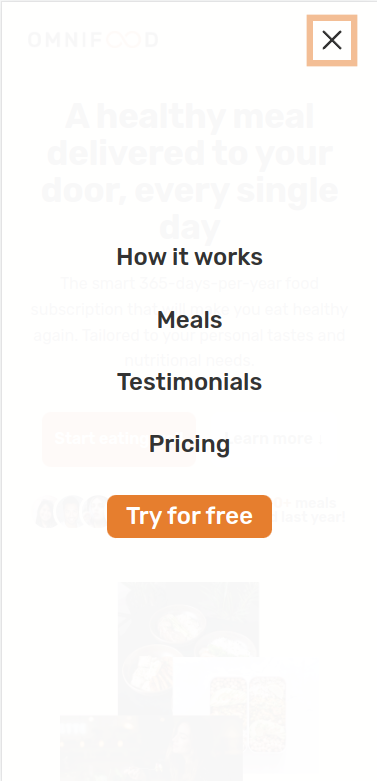

# Omnifood Landing Page

##Description
This project was developed during the HTML and CSS course by Jonas Schmedtmann on Udemy. It features a fully functional landing page, with responsive design for mobile and desktop devices. It also presents some JavaScript features like a mobile navigation menu and a smooth scrolling navigation bar.

##Screenshots

###Desktop

###Mobile

###Mobile with navigation menu

##Live webpage
https://vtrv123.github.io/omnifood-landing-page/
